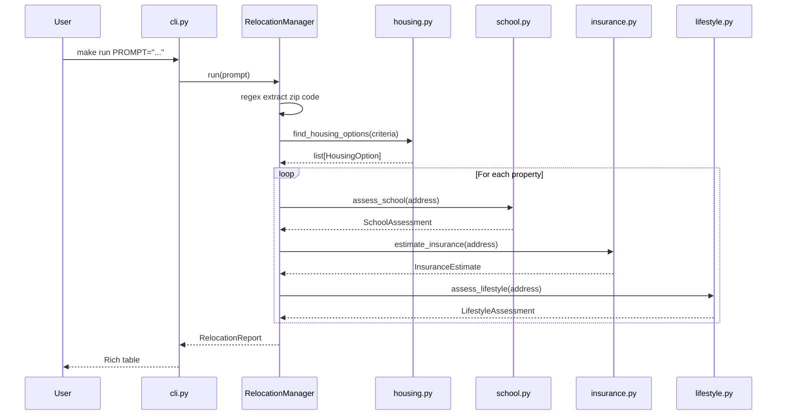
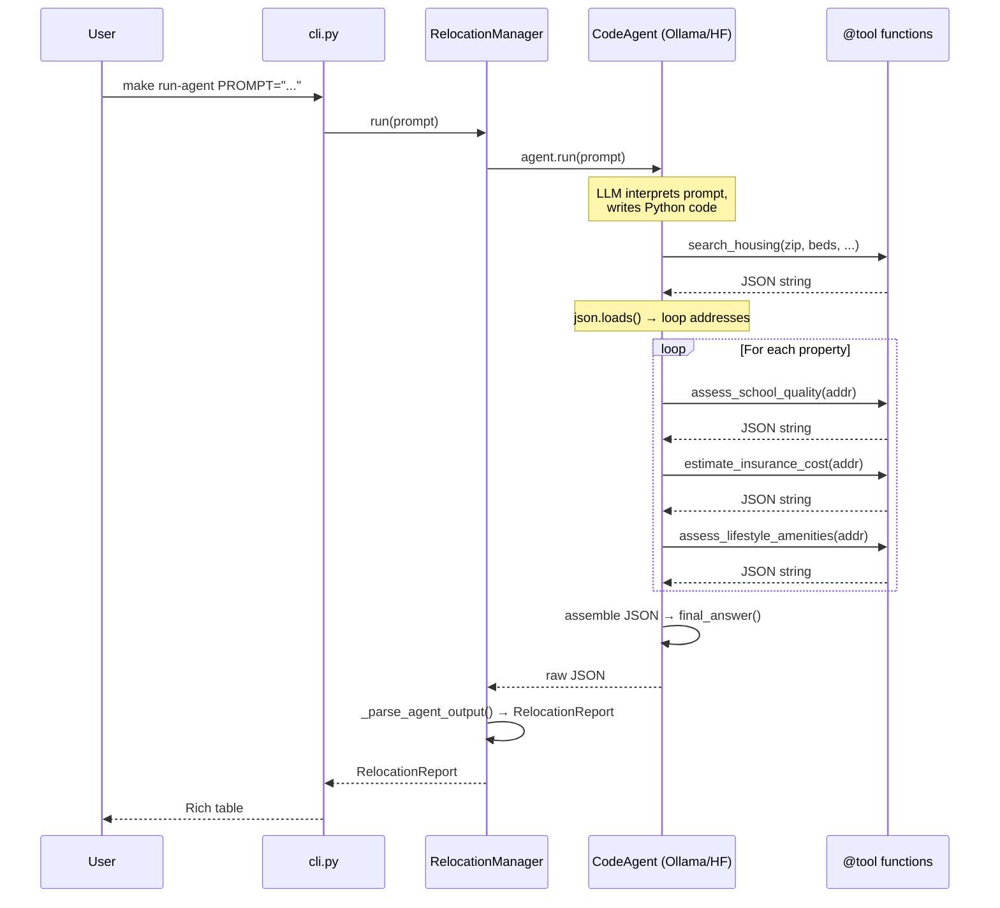

# move-me-ai — Claude Code Instructions

## What This Project Does
Autonomous AI relocation planner. A user submits a natural-language prompt (e.g. "Relocating to 10583, find 3 rentals, check schools, get insurance quotes, find nearest Indian grocery"). The system researches and returns a structured `RelocationReport` without further user input.

## Architecture
Dual-mode: direct function calls (default) or `smolagents` `CodeAgent` (`--agent` flag).

```
Direct mode (make run):
  CLI → RelocationManager._run_direct() → agent functions → RelocationReport

Agent mode (make run-agent):
  CLI → RelocationManager._run_agent() → CodeAgent (LLM) → @tool functions → RelocationReport
```

Agent mode uses a flat architecture — one CodeAgent with all 4 tools directly:
```
CodeAgent (Ollama / HuggingFace LLM)
├── search_housing()            → JSON string
├── assess_school_quality()     → JSON string
├── estimate_insurance_cost()   → JSON string
└── assess_lifestyle_amenities()→ JSON string
```

Manager assembles per-property `PropertyDossier` objects → final `RelocationReport`.

### Direct Mode Flow


### Agent Mode Flow


## Project Structure
```
src/               ← Sources Root (marked in IntelliJ)
├── agents/
│   ├── housing.py
│   ├── school.py
│   ├── insurance.py
│   └── lifestyle.py
├── tools/
│   └── providers.py
├── agent_factory.py
├── cli.py
├── logging_config.py
├── manager.py
└── models.py
tests/             ← Test Sources Root (marked in IntelliJ)
├── test_agent_wiring.py
├── test_manager.py
├── test_housing.py
└── test_cli.py
```

## Key Files
| File | Purpose |
|------|---------|
| `src/manager.py` | Orchestrator entrypoint — `RelocationManager.run()` |
| `src/models.py` | Pydantic data contracts shared across all agents |
| `src/cli.py` | CLI entrypoint — argparse + rich table output |
| `src/agent_factory.py` | CodeAgent + managed-agent wiring factory |
| `src/model.py` | HuggingFace `InferenceClientModel` factory |
| `src/logging_config.py` | Structured JSON logging to stderr |
| `src/agents/housing.py` | Housing specialist (stub → RentCast API) |
| `src/agents/school.py` | School specialist (stub → Google Places / web search) |
| `src/agents/insurance.py` | Insurance specialist (stub → heuristic/scrape) |
| `src/agents/lifestyle.py` | Lifestyle specialist (stub → Google Places API) |
| `src/tools/providers.py` | API client wrappers (`@tool` decorated for smolagents) |

## Imports
`src` is the sources root — import without package prefix:
```python
from models import HousingSearchCriteria
from agents.housing import find_housing_options
from logging_config import configure_logging
```

## Running the CLI
```bash
make run                                     # uses default prompt (zip 10583, 3BR)
make run PROMPT="Moving to 90210, 2 bedrooms, 2 bathrooms"
make run PROMPT="Relocating to 10583, max rent 5000"
make run-agent                               # smolagents CodeAgent mode (requires Ollama or HF token)
make run-agent PROMPT="Moving to 90210, 2 bedrooms"
PYTHONPATH=src python -m cli "Moving to 90210, 2 bedrooms"
PYTHONPATH=src python -m cli --agent "Moving to 90210, 2 bedrooms"
```

## Configuration (.env)
- `MODEL_PROVIDER` — `ollama` or `huggingface`
- `MODEL_ID` — model name (e.g. `qwen2.5-coder:7b` for ollama, `Qwen/Qwen2.5-Coder-32B-Instruct` for HF)
- `HUGGINGFACEHUB_API_TOKEN` — required when `MODEL_PROVIDER=huggingface`
- `OLLAMA_BASE_URL` — optional, defaults to `http://localhost:11434/v1`
- `GOOGLE_PLACES_API_KEY` — Google Places (use for lifestyle + school locality lookups)
- `GREATSCHOOLS_API_KEY` — not yet obtained
- `RENTCAST_API_KEY` — not yet obtained
- `ZILLOW_API_KEY` — not yet obtained

## Implementation Status
- [x] Pydantic models (`models.py`) with `HousingSearchCriteria` (zip, bedrooms, bathrooms, max_rent)
- [x] Manager orchestration skeleton (`manager.py`)
- [x] Stub agent functions (housing, school, insurance, lifestyle)
- [x] Housing stub with zip-aware data, bedroom/bathroom/rent filtering, sorted results
- [x] CLI accepts natural language prompt, routes through manager (`cli.py`)
- [x] Structured JSON logging (`logging_config.py`)
- [x] Multi-provider model factory (`model.py`) — supports Ollama (local) and HuggingFace
- [x] Dev tooling (ruff, mypy, pytest, Makefile)
- [x] 43 tests (housing filters, CLI args, render output, model factory, agent wiring)
- [x] Wire `smolagents` `CodeAgent` + `ManagedAgent` into manager (dual-mode: `--agent` flag)
- [ ] Housing: real listings via RentCast API
- [ ] School: ratings via Google Places / web search fallback
- [ ] Insurance: heuristic estimates (no free API; derive from address/zip data)
- [ ] Lifestyle: Google Places API (groceries, parks, libraries)
- [ ] Integration tests for full orchestration flow

## Coding Conventions
- Python 3.10+, typed throughout (`from __future__ import annotations`)
- All cross-agent data must be typed Pydantic models from `src/models.py`
- All external API calls live in `src/tools/providers.py` as `@tool`-decorated functions
- Agent files in `src/agents/` should stay thin — logic goes in tools
- Line length 100, double quotes, ruff + mypy must pass (`make check`)
- Tests in `tests/`, run with `make test`

## smolagents Patterns to Follow
- Manager must be a `CodeAgent` (writes Python, not JSON)
- Each specialist must be wrapped as a `ManagedAgent` — prevents context bleed
- Tools decorated with `@tool` from `smolagents`
- Load env vars via `python-dotenv` at startup; never hardcode keys

## Developer Commands
```bash
make lint       # ruff check
make fix        # ruff --fix
make format     # ruff format
make typecheck  # mypy
make test       # pytest
make check      # lint + typecheck + test
make run        # run relocation planner (PROMPT= optional)
make run-agent  # run in smolagents CodeAgent mode (requires HF token)
make ping-model # send test prompt to HuggingFace model
```
